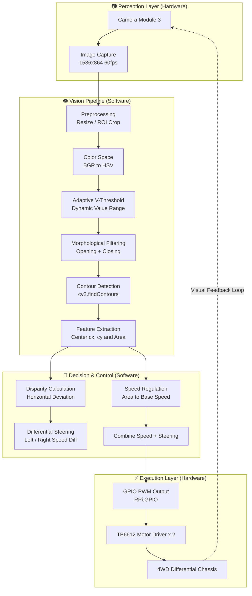

# Vision Navigation Robot

> A Raspberry Pi 5 based autonomous robot that tracks a red target in real time using computer vision.

## 📖 Documentation

- **[Development Journal](docs/journal.md)** — A detailed record of my entire development process, including problems faced, solutions tried, and lessons learned.
---

## 📸 Demo


> Watch the demo video (https://youtu.be/aLPEfafGhwM?si=glDIG7xexDDY1jnS)
---

## 🎯 What It Does

This robot is a complete **vision-to-motion** system. It uses a camera to see a `red` object, processes the image in `real time` to find its `location`, and `drives toward it` — all on a `Raspberry Pi 5`.

**Key capabilities:**
- Real-time red object detection and tracking
- `Adaptive HSV thresholding` for changing lighting conditions
- Differential drive steering via `visual feedback`
- Target loss detection and `automatic re-acquisition`

---

## 🧠 Why I Built It

>My interest in autonomous systems started early — 
> when I first learned to code with graphical programming languages, 
> I was fascinated by how a set of logical rules could make a virtual system "think." 
> But it wasn't until I studied C++ that I realised I wanted to go further. 
> I no longer wanted my code to stay inside the screen; I wanted it to move something in the real world.
>
> That's when I decided to build a robot — a physical system that could see, decide, and act.
>
> I chose an autonomous car over other possibilities (such as a manipulator) for a personal reason: 
> I've seen how dangerous search-and-rescue missions can be for firefighters and first responders. 
> If a small, intelligent vehicle could enter a hazardous area first — mapping the environment or locating victims — 
> it could protect human lives. This project is my first step toward that vision: a robot that can track a target, 
> follow it, and eventually navigate through unknown spaces.
>
> Building this car taught me how to bridge the gap between hardware and software — 
> a skill I believe is essential for the future of robotics and human-centered engineering.

---

## 🔧 How It Works

#### The robot is a closed-loop control system: the camera captures an image, the software processes it to find the target, and the motors move the robot accordingly.

### 🏗️ System Architecture


### 💡 Key Technical Highlights

#### Adaptive HSV Thresholding
> Fixed colour thresholds fail when lighting changes. 
> Instead of using a static range, 
> I implemented a dynamic V‑channel adaptation that calculates the mean and standard deviation of brightness per frame, 
> automatically expanding the detection range in dark scenes and tightening it in bright scenes. 
> This keeps tracking stable across different lighting conditions.

#### ROI Optimization + Global Search
> Processing every pixel of each frame in video stream is extreme expensive. The robot uses a `Region Of Interest (ROI)` to
> overcome this situation. It will search around last found coordinate, which reduces the processed area by ~70% and improves frame rate.
> And if the target is lost, the system return to `global search` to search the entire frame.

#### Differential Drive
> The system uses the horizontal disparity between the screen centre and the object centre. Consequently, a percentage of disparity is
> calculated. `Steering.py` will then be adjusting the speed and direction 	based on the calculated offset ratio.
> 
## 📂 Project Structure

```text
vision-navigation-robot/
├── main.py              # Main entry point
├── config.py            # Centralized configuration
├── Vision/
│   ├── red_coor.py      # HSV + adaptive threshold + red detection
│   └── disp_and_area.py # Disparity & area calculation
├── Hardware/
│   └── motor.py         # TB6612 motor driver wrapper
├── Control/
│   └── steering.py      # Differential steering logic
└── docs/
    ├── journal.md       # Bilingual development journal
    └── Hardware information & Photo/
```

## 🚀 Getting Started

```bash
# optional
sudo apt update
sudo apt install -y python3-pip python3-venv python3-opencv \
  python3-picamera2 python3-prctl libatlas-base-dev ffmpeg \
  libopenjp2-7

# for project
git clone https://github.com/Yuzii-afk/vision-navigation-robot.git
cd vision-navigation-robot
pip install -r requirements.txt
python main.py
```

---

## 🔭 What‘s Next

- **Full PID control** — replace simple P‑control for smoother steering
- **Encoder feedback** — close the speed loop for consistent motion
- **Multi‑color support** — extend detection beyond red

---

## License
This project is licensed under the MIT License - see the [LICENSE](LICENSE) file for details.